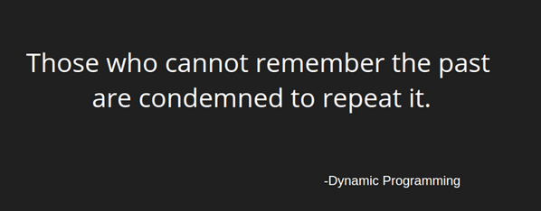
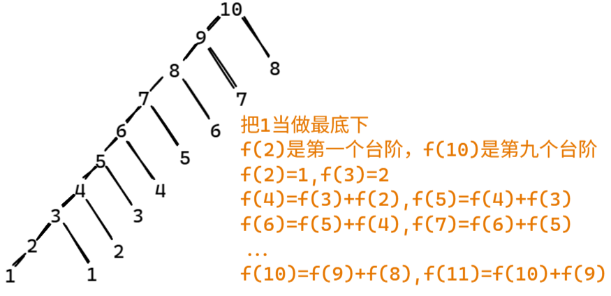

# Algorithm
Recording notes about learning algorithms  
[zhihu](https://zhuanlan.zhihu.com/p/365698607)  
  
核心思想：拆分子问题+记住过往（减少重复计算）  

如果一个问题，可以把所有可能的答案穷举出来，并且穷举出来后，发现存在重叠子问题，就可以考虑使用动态规划。

1. 大的问题拆成小问题
2. 如何从小问题得到较大问题的答案？也就是大小问题之间建立连接?

总之，如何拆解？如何建立联系？

> 套路
1. 穷举分析：要求的f(n)总可以穷举完
2. 确定边界：确定什么时候是最初的结果，斐波那契边界就是f(1)=1,f(2)=2
3. 找规律，确定最优子结构：找到重复计算的式子，斐波那契重复的式子：f(n) = f(n-1)+f(n-2)
4. 写出状态转移方程：什么时候跳转

leetcode原题：一只青蛙一次可以跳上1级台阶，也可以跳上2级台阶。求该青蛙跳上一个 10 级的台阶总共有多少种跳法。
1. 穷举分析
    
2. 确定边界：边界就是f(2)=1,f(3)=2
3. 找规律，确定最优子结构： f(n-1)+f(n-2)
4. 写出状态转移方程

f(n) = f(n-1)+f(n-2) ,当n>=3 ;f(n)=n,当n=1,2
实现代码的时候，一般注意从底往上遍历，然后关注下边界情况，空间复杂度

``` java
dp[0][0][...] = 边界值
for(状态1 ：所有状态1的值){
    for(状态2 ：所有状态2的值){
        for(...){
          //状态转移方程
          dp[状态1][状态2][...] = 求最值
        }
    }
}
```